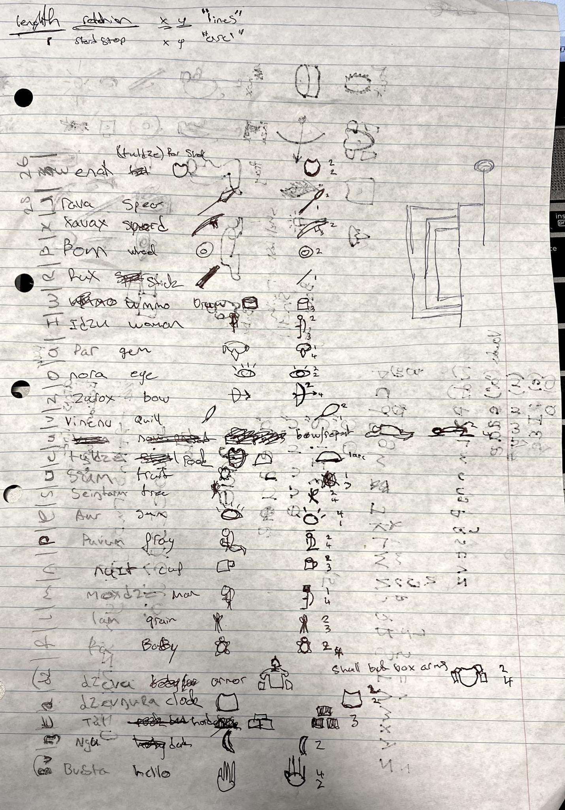
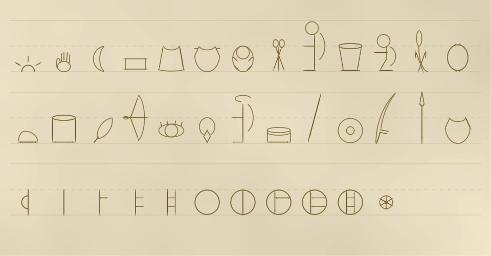
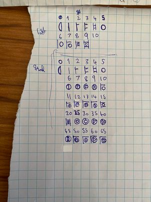
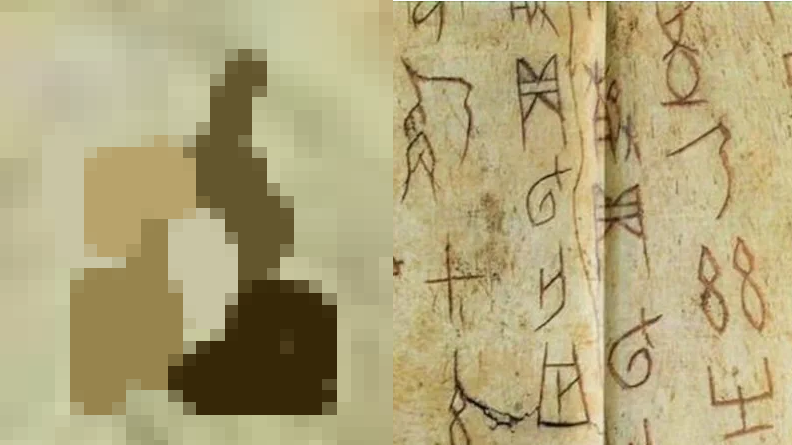
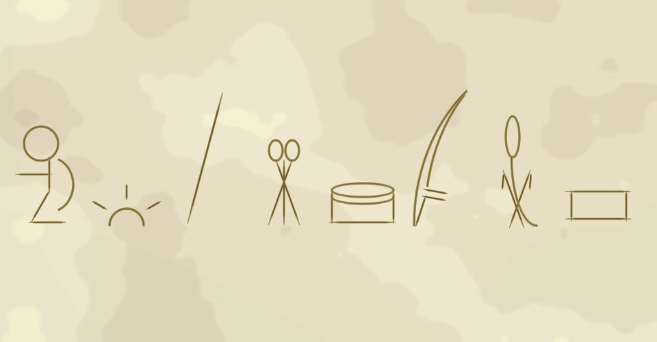
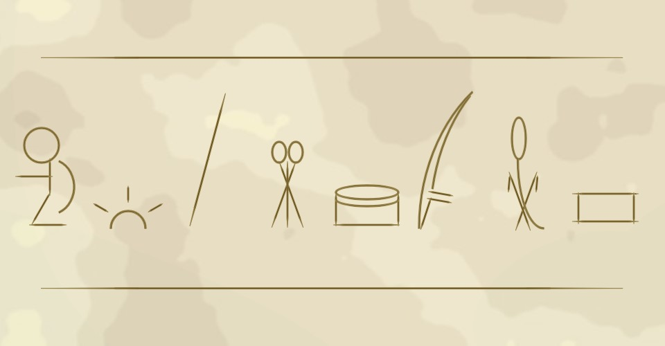

## MDDN 242 2024 Assignment 2
### Lliam Booth

## Parluxst
meaning: greetings to the light of the morning

## Design
I began the project initally unsure of the direction i wanted to go in i had the idea to link this project into one of my own personal world building projects or but i was initally unsure and so began by making a simple rectangle based font for the letters ABCD. Eventually i decided that I might as well. and so i decided on creating an Alphabet for one of the early languages of the Tunak (Parluxst). A spacefaring race of turtle like humanoids whos ancient history and cultures I plan to create and catalogue both as an absolute record and as an in universe textbook style telling with all the inacuraccy and misunderstanding that entails.

### Frontload Paper Design

To that end I decided on using this as a starting point for this assignment. with that in mind I began by taking a small collection of words linked to simple concepts and often used items, and taking one of their primary phonemes(distinct units of sound such as p, b, d,  and t seen in the words pad, pat, bad, and bat) to be used as a letters for this project. Once I had assisgned a word to each unique Phoneme in Parluxst i created a basic symbol which literaly depicts the concept or item of the word for example a drawing of a rock for the word meaning rock. this type of letter form was inspired primarily by realworld examples of early writing systems. almost all of which were developed from drawings of the objects or concepts being depicted eventually coming to be associated with an individual sylable and eventually single Phonemes. one of these systems which was my primary inspiration was that of oracle bone script (see below) which is an early chinese writing system which uses hundreds of unique bone carved sybols to depict words. 

because Parluxst has far fewer Consonants than english and thus the 26 letter alphabet is too large i stretched the number of letters by having a unique sybol for each vowel variation rather than the single symbol system that english uses for vowels. This got me to the magic 26 and from here it was simply a matter of simplifing and then creating the symbols for code. The simplification of symbols wents well as I managed to reduce the symbols complexity down to 4 lines and two arcs at most with many having less than this. See list of Phoneme [conversions][def]

### Into The Code

I began by using a simple line function to draw the lines but i quickly found that these would use far to many variables so i instead used rect functions with rotate to reduce the number of variables. to further this i created a custom rect function that only used 4 variables to draw a rect with a constant width with custom rotation length and x,y positioning. 4 of these lines as well as 2 custom arc functions brought my total variable to 25 i spent several days trying to find a way of reducing this number without compromising too heavily on the design of the letterforms this proved to not be posible and so I continued with 25 variables 5 over the briefs condition.

From this point in the project it was primarily grunt work taking my paper sketches and creating them in code making minor adjustments to a couple to make them more aesthetically pleasing and easier to recreate in code.
 
once all the letters were created I grabbed my pre-existing numerals and added them into the project making minor changes to acomodate the restrictions of this project. 

 

once this was completed I started work on the background 

### Background
 
I wanted to make the background look like bone to connect back with the primary inspiration of the oracle bone script as Parluxst would be carved on similar bone pieces. To do this I used two layered noise functions to create a variable coloured backround using colours taken from an image of an oracle bone carving these colours where edited slightly based on what i felt looked better although these changes were limited. 

 
Intially the background noise was generated every time the page was updated this caused large load times in Alphabet mode and was completely unusable in Exhibition mode i initally tried using noiseseeds to help reduce load time but this had little effect on load times so I went to get some help from tutors together we came up with two solutions the first of which worked to some extent but was still not fast enough to get Exhibition mode working so I scraped the idea of having new noise on each load and instead saved a noise image for both views. The code to create the noise patterns is contained within Alphabet.js if future users wish to change the background images of either view.
Looking at the Exhibition mode i felt it still didnt look right so i added several lines using my makeLine function to add some visual interest and I feel this had a massive impact on how it looks.
 

## Letter Conversions

[def]: #LettersConversion

Reading Conversion table
POS: the postion of Parluxst letter in Alphabet.js
Parluxst Phoneme: the Phoneme the letter represents in IPA format (International Phonetic Alphabet)
ENGLETTER: The english letter that represents the phoneme if applicable ie english has that sound or sounds that are similar eg R for a "rolled" R sound

| POS | Parluxst Phoneme    | ENGLETTER    |
| :---:   | :---: | :---: |
| A | [ɐ](https://en.wikipedia.org/wiki/Near-open_central_vowel)   | A   |
| B | [b̪͡v](https://en.wikipedia.org/wiki/Voiced_labiodental_affricate)   | BV   |
| C | [ŋ](https://en.wikipedia.org/wiki/Voiced_velar_nasal)   | NG   |
| D | [d͡z](https://en.wikipedia.org/wiki/Voiced_alveolar_affricate)   | ?   |
| E | [ɛ](https://en.wikipedia.org/wiki/Open-mid_front_unrounded_vowel)   | E   |
| F | [f](https://en.wikipedia.org/wiki/Voiceless_labiodental_fricative)   | F   |
| G | [ʊ](https://en.wikipedia.org/wiki/Near-close_near-back_rounded_vowel)   | U   |
| H | [ɑ](https://en.wikipedia.org/wiki/Open_back_unrounded_vowel)   | A   |
| I | [ɪ](https://en.wikipedia.org/wiki/Near-close_near-front_unrounded_vowel)   | I   |
| J | [e](https://en.wikipedia.org/wiki/Close-mid_front_unrounded_vowel)   | E   |
| K | [u](https://en.wikipedia.org/wiki/Close_back_rounded_vowel)   | U   |
| L | [l](https://en.wikipedia.org/wiki/Voiced_alveolar_lateral_approximant)   | L   |
| M | [m](https://en.wikipedia.org/wiki/Voiced_bilabial_nasal)   | M   |
| N | [n](https://en.wikipedia.org/wiki/Voiced_alveolar_nasal)   | N   |
| O | [o](https://en.wikipedia.org/wiki/Close-mid_back_rounded_vowel)   | O   |
| P | [p](https://en.wikipedia.org/wiki/Voiceless_bilabial_plosive)   | p   |
| Q | [a](https://en.wikipedia.org/wiki/Open_front_unrounded_vowel)   | A   |
| R | [ʀ](https://en.wikipedia.org/wiki/Voiced_uvular_trill)   | R   |
| S | [s](https://en.wikipedia.org/wiki/Voiceless_alveolar_fricative)   | S   |
| T | [t](https://en.wikipedia.org/wiki/Voiceless_alveolar_plosive)   | T   |
| U | [ɯ](https://en.wikipedia.org/wiki/Close_back_unrounded_vowel)   | U   |
| V | [v](https://en.wikipedia.org/wiki/Voiced_labiodental_fricative)   | V   |
| W | [β](https://en.wikipedia.org/wiki/Voiced_bilabial_fricative)   | S   |
| X | [x](https://en.wikipedia.org/wiki/Voiceless_velar_fricative)   | X/K   |
| Y | [ɺ](https://en.wikipedia.org/wiki/Voiced_alveolar_lateral_flap)   | R   |
| Z | [z](https://en.wikipedia.org/wiki/Voiced_alveolar_fricative)   | Z   |

### Some background lore

As breifly mentioned above the *Tunak* are a species of turtle like Humanoids Originating from the Planet *Enurk* (Shell of the god). *Parluxst* is one of the oldest recorded languages of the *Tunak*, spoken primarily by the *Ngavan* people. Who are the first recorded group to worship the sun god *Aur* as part of an organised religous system. The common belief was that the sun was *Aur's* soul and *Enurk* was his shell which his chosen people where allowed to live on, under his holy protection and nurishment. 
The development of Writing systems on *Enurk* followed a similar path as those on earth with the first writings using simple symbols and numbers primarly to record burecratic numbers such as the amount of grain a farmer made that year or the number of warriors that could be feed with current food stores. These writings were primarily made on clay tablets and were limited in scope, the true development of more advanced writing systems within *Ngavan* society was in religous texts, these texts were often enscribed on the *Enaktul* (shell) of the dead due to their sacred status. The more complex nature of these prayers and laments for the dead was the primary driving force for more complex writing systems.